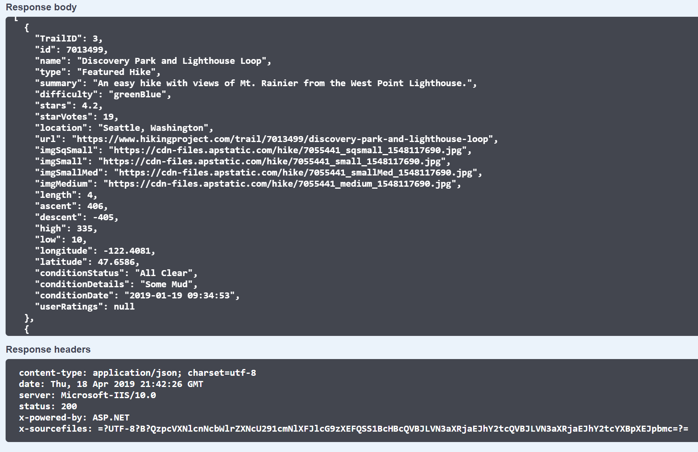
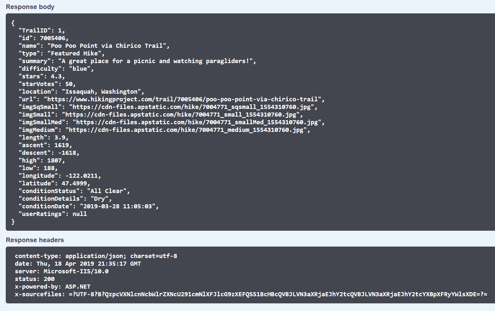
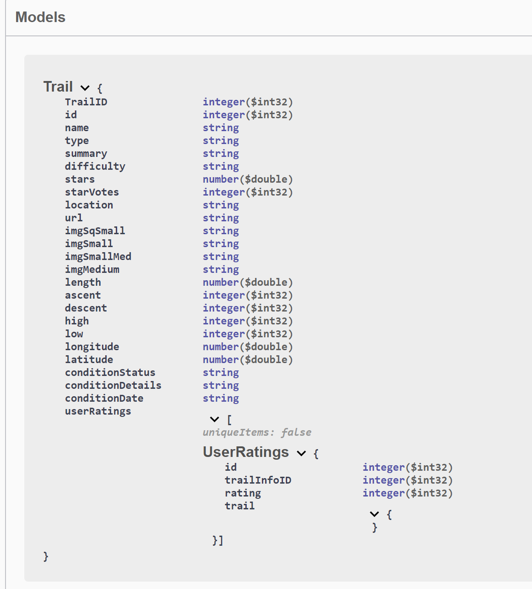
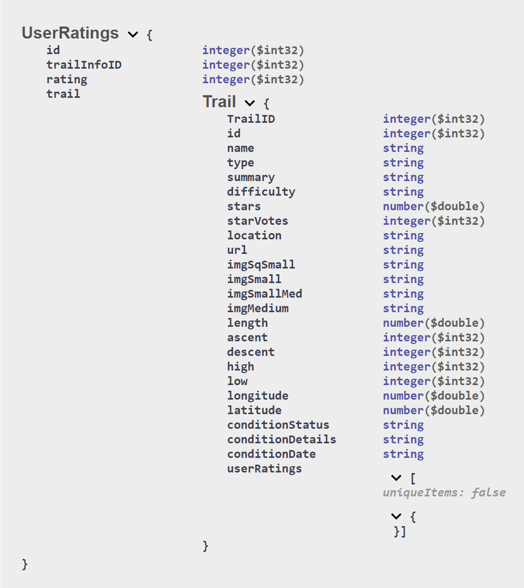

# Switchback API #

## **["Venture Into The Known"](https://switchback.azurewebsites.net/)**

## Developers ##

- [Andrew *"Roketsu"* Roska](https://github.com/Roketsu86)

- [Christopher *"Secret Squirrel"* Morton](https://github.com/cmorto02)

- [Ian *"Hype Man"* Gifford](https://github.com/IanGifford261)

- [Michael *"The Wizard"* Kelly](https://github.com/Michael-S-Kelly)

- [Tanner *"SKNY-TannMann"* Percival](https://github.com/Tanner253)

# About Switchback #


### Version 1.0 ###
- 1.0.0 *Initial Build in progress* 15 APR 2019

### Problem Domain ###

Are you tired of sitting around wondering where to go for a hike but cant rememeber all the trails or a particular trail youve heard of in the area? Well look no further! We here at team *Switchback* have all that covered for you! Our website will allow you to explore, review, rate and comment on trails in your local area! We are excited to bring this to you, *Venture into the Known*.

## Libraries/API's/Dev environments-Dev Tools

- Libraries
   - [X] VS Community

   - [X] Azure/DevOps

   - [X] MVC Framework with Entity

   - [X] XUnit Testing

   - [X] Bootstrap CSS


- API's
   - [X] [In house Switchback API](https://github.com/targaryen-house/API-App)

   - [X] [OpenWeather](https://openweathermap.org/api)


### How to set up locally ###

- Clone the repository onto your machine
   - Once Repo is cloned and set up within ```VS Community``` 

_________UNDER DEVELOPMENT_________

### API & MVC User Stories ###

- As a User, I want to be able to search for trails in a given area or by specific keywords.
   - Features
      - Create a Search page for Home Index view
      - Add Regex to search to prevent strings that would result in garbage queries
      - Query our API with search params
      - Process returned data and send to correct View

   - Acceptance
      - Ensure search parameters are able to be pulled with valid keywords
      - Ensure the query returns valid data

- As a User, I want to be able to navigate through different trails that I have searched for, so that I can find trails that excite me.
   - Features.
      - Display returned search data in a list of thumbnails with quick-access info
      - Provide delimiters for search results to narrow down options
      - Display an icon on any "hidden gem" trails for easy identification
      - Allow users to redirect to a page to add their own "hidden gem" trails

   - Acceptance
      - All trail data is accurate and easy to digest
      - Search results can be narrowed down by using the delimiters
      - "Hidden gems" link correctly redirects

- As a User, I would like to know the weather conditions at the trails I am viewing so that I can make informed decisions regarding when I would like to visit the trail.
   - Features
      - On page load of idividual Details View query OpenWeather for the weather at co-ords of hike
      - Deserialize incoming json package
      - Display weather icon and temperature in Quick Facts panel

   - Acceptance
      - Ensure API key from weather API is valid and returns needed data
      - Ensure that data is rendered properly to be shown on view 

- As a User, I would like to share my feedback for the trails I have visited, so that others can make an educated decision if they would like to attempt the trail or not.
   - Features
      - Add a field for user comments
      - Store user comments in SQL DB
      - Display 10 most recent comments at the bottom of the Details View
      - Add a link to View for all comments for the trail

   - Acceptance
      - Ensure that a particular user can comment and verify that it is added to the trail
      - Ensure that the relevant number of user comments (chronologically) are displayed on the site.

- As a Developer, I want to be able to get trail information from our API so that I can display it to our users.
   - Features
      - Query Trails on the API
      - Process returned json package
      - Display results in Details View

   - Acceptance
      - Ensure query returns json in the format expected

- As a Developer, I want to be able to update trail conditions and user ratings on our API.
   - Features
      - Impliment a drop-down menu on the Details View for users to select from a list of typical conditions the trail may be experiencing
      - Impliment 5-point star rating selection on Details View
      - Gather condition and rating into a package and POST to our API
      - Update Details page to reflect user submittied conditions and ratings

   - Acceptance
      - Ensure that when an update is entered, it is reflected on the Details View

- As a User, I want to be able to add little-known trail information to the API so that other users can discover my "hidden gems".
   - Features
      - Add a submission form for users to submit thier own trails
      - Query Trails on the API to check if user-submitted trail exists already
      - Update trail information on API if it already exists
      - Add trail information to the API if it does not exist

   - Acceptance
      - User submitted trails should return and display the same as any other trail in our API
      - User submitted trails should be marked with a unique icon to indicate they are user submitted

### Database Entity Relationship Diagram(ERD)

Our API app will connect to a SQL database with two tables.  The first table will store Trails Information for all trails.  The second table will store User Ratings.  The API will accept a location and get a Latitude and Longitude from Bing.  It will then pull trail information from hiking project API.  It will then compare the received information to the pulled information on the database to reduce duplicates.  It will then send the information back to the querying website.  In addition, it will accept user edits to the trail information from a website as well as user ratings of individual trails.


### API Endpoints and Call/Response Sample ###

- Example call From our API:

  - *Call to be made*: https://switchbackapi.azurewebsites.net/api/bing?query=Seattle
*Returned data*


  - *Call to be made*: https://localhost:44308/api/Trail/1
*Returned data*


Models






